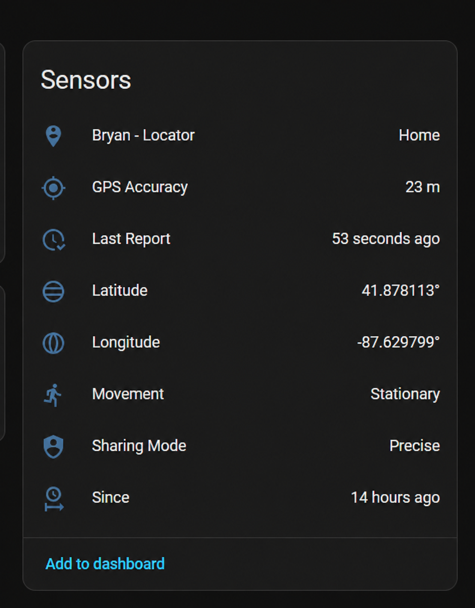

# PixoraLocator

Official Pixora Locator integrations for Home Assistant and Hubitat. The phone APK is distributed separately and is not stored in this repository.

## Home Assistant

1. Navigate to the app store in the Home Assistant UI: **Settings**, **Apps**, then **Install App**.
2. Select the three vertical dots in the upper-right corner and select **Repositories**.
3. At the bottom of the **Repositories** screen, click **Add**.
4. Enter this project's GitHub page URL and click **Add**:

   ```text
   https://github.com/bptworld/PixoraLocator
   ```

5. After adding the repository, go back to the **App Store**, select the three vertical dots, and select **Check for updates**.
6. Scroll down the **App Store** or use search to find **Pixora Locator**.
7. Select **Pixora Locator** and click **Install**.
8. In the Pixora Locator phone app, open **Settings → Home Assistant App** and create a pairing token.
9. Before starting the Home Assistant App, open its **Configuration** tab, paste the token, and click **Save**.
10. Start Pixora Locator and open it from the app page or sidebar. Its page will show the connection and device status.

The same page can create a one-time `.pixora` migration file from selected Home Assistant zones. Locator turns them into Places without reading or importing location, arrival, or departure history and without creating a continuing synchronization. New Places start fresh; existing matching Places keep their current settings and activity.

### One-time zone migration

1. Open the **Pixora Locator** App page in Home Assistant and select **Migrate Home Assistant zones**.
2. Choose up to 50 zones and download the checksummed `.pixora` file.
3. On the phone, open **Locator → Settings → Home Assistant App → Import Home Assistant Places**.
4. Choose the file, review the zones, turn off any you do not want, and select **Import Places**.
5. After Locator confirms the import, delete the downloaded file.

A Locator household can keep up to 75 Places. The migration imports zone names, center points, and radii only. It never includes tracker records, recorder history, arrival or departure activity, passwords, access tokens, automations, or unrelated entities. The Pixora Locator Home Assistant App can run beside the official Home Assistant Companion App while the file is created; the two apps do not replace or modify each other. After the one-time import, the new Locator Places are independent of Home Assistant.

## Home Assistant device details

Each shared phone appears as one Home Assistant device with its current location details available as individual sensors.



_Screenshot uses fictional coordinates._

## What it does

- Creates managed Home Assistant device trackers using Home Assistant's built-in Mobile App integration.
- Uses each phone's saved Pixora Locator device name.
- Synchronizes only the current position of household phones that are actively sharing.
- Adds separate visible Place, Latitude, Longitude, GPS Accuracy, Since, Movement, Sharing Mode, and Last Report sensors to each phone device.
- Marks a tracker away when sharing stops or its current position is unavailable.
- Starts automatically with Home Assistant and recovers removed tracker registrations.
- Provides its own Home Assistant page showing connection health, last sync, and device status.
- Uses the Home Assistant App version so the App store displays an update when a newer Pixora Locator release is available.

The Home Assistant App source is in [`pixora_locator/`](pixora_locator/).

## Hubitat

Each phone can update its own Pixora Locator virtual device with the latest location, saved Place, presence, accuracy, battery, and human-readable report time.


_Screenshot uses fictional coordinates._

1. In Planner, connect Hubitat under **Setup Options → Hubitat** using the Maker API Cloud URL, App ID, and access token.
2. In Hubitat, open **Drivers Code** and choose **New Driver**.
3. Paste the contents of [`hubitat/PixoraLocator.groovy`](hubitat/PixoraLocator.groovy) and save it.
4. Open **Devices**, choose **Add Device → Virtual**, and select **Pixora Locator** as the device type, then enable it in Maker API.
5. In the Pixora Locator phone app, enable Hubitat under **Settings → Where to send** and select the virtual device.

The Hubitat driver source and detailed instructions are in [`hubitat/`](hubitat/).

### One-time OwnTracks Place migration

Install the separate [`Pixora Locator OwnTracks Importer`](hubitat/PixoraLocatorOwnTracksImporter.groovy) Hubitat app to receive an OwnTracks region list through OwnTracks' existing Secondary Hub transfer. The importer is armed manually, accepts only a waypoint list, rejects live locations, and automatically deletes its temporary Place definitions after one hour. It creates a checksummed `.pixora` file containing only selected Place names, center points, radii, and stable OwnTracks waypoint IDs.

Locator imports up to 50 selected OwnTracks Places into a household with a maximum of 75 Places. It imports no location history, arrival/departure activity, alert settings, members, credentials, or continuing synchronization. OwnTracks itself is not changed.
