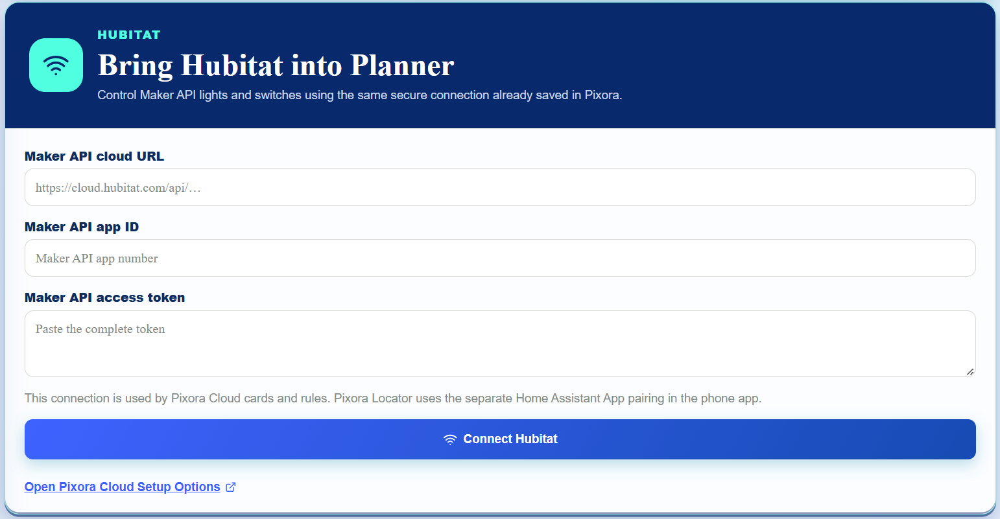
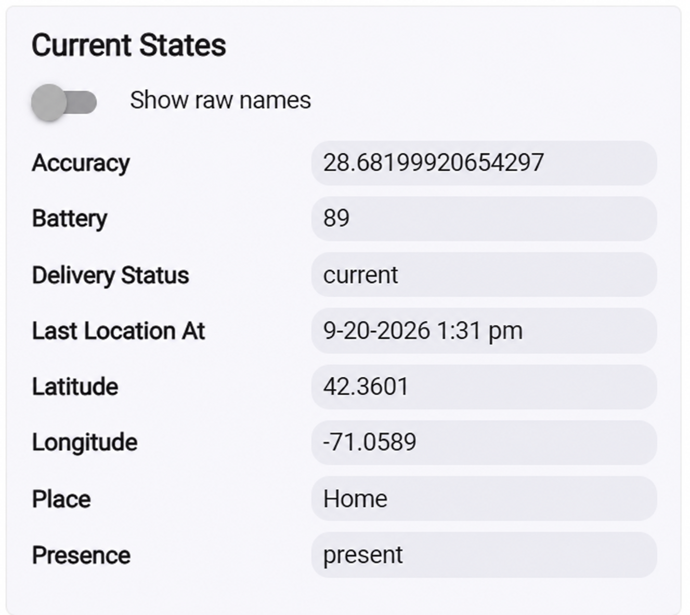

# Pixora Locator for Hubitat

1. In Planner, open **Setup Options → Hubitat**. Enter the Maker API Cloud URL, App ID, and access token, then select **Connect Hubitat**.

   

   Keep the Maker API access token private. The screenshot uses placeholders and contains no working credentials.

2. In Hubitat, open **Drivers Code**, choose **New Driver**, paste `PixoraLocator.groovy`, and save it.
3. Open **Devices**, choose **Add Device → Virtual**, give it the same name as the phone in Pixora Locator, and select **Pixora Locator** as its type.
4. Open the Maker API app and enable that virtual device.
5. In the Pixora Locator phone app, open **Settings → Where to send**, enable Hubitat delivery, and select the virtual device.

PixoraHQ sends the current latitude, longitude, accuracy, saved-place name, presence, battery level, and capture time to the virtual device. Credentials stay on PixoraHQ; the phone never stores the Hubitat access token.

## Device states

The virtual device shows the phone's latest location information directly in Hubitat, including a report time formatted in the hub's local timezone.

_Screenshot uses fictional coordinates._
