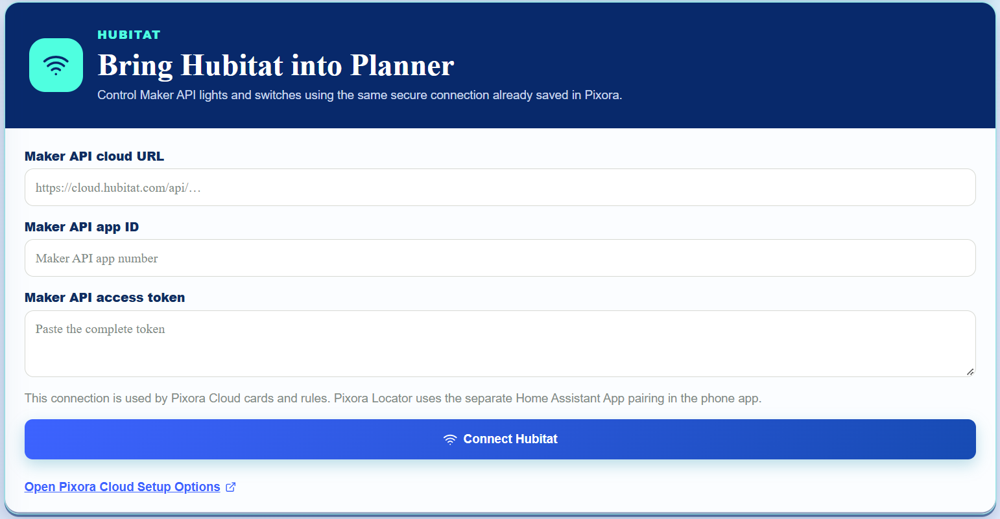
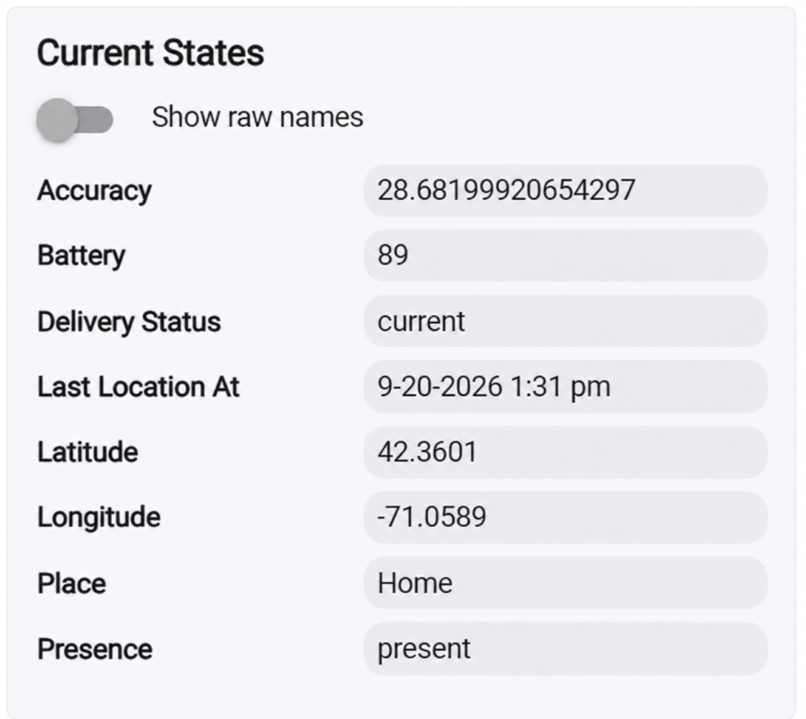

# Pixora Locator for Hubitat

1. In Planner, open **Setup Options → Hubitat**. Enter the Maker API Cloud URL, App ID, and access token, then select **Connect Hubitat**.

   

   Keep the Maker API access token private. The screenshot uses placeholders and contains no working credentials.

2. In Hubitat, open **Drivers Code**, choose **New Driver**, paste `PixoraLocator.groovy`, and save it.
3. Open **Devices**, choose **Add Device → Virtual**, give it the same name as the phone in Pixora Locator, and select **Pixora Locator** as its type.
4. Open the Maker API app and enable that virtual device.
5. In the Pixora Locator phone app, open **Settings → Where to send**, enable Hubitat delivery, and select the virtual device.

PixoraHQ sends the current latitude, longitude, accuracy, saved-place name, presence, battery level, and capture time to the virtual device. Credentials stay on PixoraHQ; the phone never stores the Hubitat access token.

## One-time OwnTracks Place migration

The separate `PixoraLocatorOwnTracksImporter.groovy` Hubitat app can turn regions already managed by the OwnTracks Hubitat app into ordinary Pixora Locator Places. It uses OwnTracks' existing **Send Region List to Secondary Hub** feature; it does not modify OwnTracks or read OwnTracks' private app state.

1. In Hubitat, open **Apps Code**, choose **New App**, paste `PixoraLocatorOwnTracksImporter.groovy`, save it, and enable OAuth for that app code.
2. Open **Apps → Add User App → Pixora Locator OwnTracks Importer** and finish installing it.
3. Open the importer and select **Arm receiver for 10 minutes**.
4. Copy its private local receiver URL.
5. In OwnTracks, open **Link Secondary Hub**, paste that URL, and temporarily enable the secondary hub.
6. In OwnTracks, open **Configure Regions** and select **Send Region List to Secondary Hub**.
7. As soon as the importer confirms receipt, disable the OwnTracks secondary hub and clear its URL.
8. In the Pixora importer, choose up to 50 Places and download the `.pixora` file.
9. In Locator, open **Settings → OwnTracks Places from Hubitat**, choose the file, review the Places, and import them.
10. Delete the downloaded file and select **Clear temporary capture** in Hubitat.

The receiver works only for ten minutes after being armed and disarms after one successful list. It rejects live location messages and stores no member location, history, alerts, credentials, or phone details. Captured Place definitions expire from Hubitat automatically after one hour. Synthetic `+follow` regions and Places pending deletion are excluded. New Locator Places begin without history or alerts; an existing matching Place keeps its existing activity and settings.

## Classic Dashboard avatar tile

No separate Hubitat app is needed. Update this driver, open the virtual phone device, and select **Save Preferences** (or **Refresh**). New location reports supply the member's Planner avatar automatically; if no Planner photo exists, the Locator avatar or initial is used.

1. In **Apps → Hubitat Dashboard**, open your existing classic dashboard app and include each Pixora Locator virtual phone device in its allowed devices.
2. Open that dashboard and add a tile. Select the phone device and the **Attribute** template.
3. Choose **locatorTile** as the attribute. Start with a tile spanning two columns and three rows, then resize to fit your dashboard's fonts and grid.
4. Optionally add another Attribute tile using **locatorDetails** for the additional GPS accuracy, sharing mode, and battery-optimization details.

On each virtual phone device, use **Preferences → Smaller tile - Line 1 / Line 2 / Line 3** to choose each stat and its order, then select **Save Preferences**. Choose **None** to hide a line. Defaults are battery, distance from Home, and speed. A separate **Show avatar on smaller tile** switch controls the photo. Name, Place, and health remain visible. The larger `locatorDetails` card stays alphabetical and independent of these selections. If a card exceeds the size limit, it shortens content and indicates omitted rows.

The main avatar card uses a compact table for battery, straight-line distance from Home, and speed. Charging reports show a power indicator. The details card adds power status, movement, arrival time, report time, rounded GPS accuracy, sharing, and battery unrestricted status. It refreshes on existing deliveries and on the driver's local freshness check; it does not request GPS or poll PixoraHQ for location. Both tile values stay within classic Dashboard's 1,024-byte limit. Very long labels or avatar links can shorten the cards. If a new attribute is missing from the dropdown, refresh the device and reload the dashboard.

Photos require internet access from the dashboard browser. The driver uses an image-only link valid for at most 24 hours, renewed with location deliveries, and falls back to an initial before the link expires. Turning sharing off, disabling Hubitat delivery, or changing its target revokes access to that photo link. Treat dashboard links and device event history as private: they contain personal location stats and temporary photo links. The image endpoint grants no access to location records or account credentials. This is for **Hubitat Dashboard**, not Easy Dashboard.

## Individual attributes

The driver also exposes `distanceFromHome`, `speed`, and `charging` for dashboards and rules. Distance is straight-line distance to the latitude/longitude in **Hubitat → Settings → Hub Details**, not driving distance or distance to the edge of a saved Place. Check those home coordinates before using it. Each received location recalculates distance and speed. **Distance and speed units** defaults to miles/mph; kilometers/km/h is also available.

`charging` reports **charging**, **not charging**, or **unknown** (older phone versions or unavailable battery status). A full battery connected to power counts as charging. Missing or invalid speed and unavailable home coordinates leave the corresponding numeric attribute empty instead of pretending it is zero. Stale delivery leaves the last reported measurements in place with `deliveryStatus: stale`; clearing sharing clears these measurements and resets charging to unknown. These are last-report values, not a separate live battery feed.

The virtual device shows the phone's latest location information directly in Hubitat, including a report time formatted in the hub's local timezone.

Additional rule attributes are `locationHealth` (current/delayed/stale/one-time/off), `movement`, `atPlaceSince` (readable date/time in the hub's timezone, such as Oct 4, 2026 at 12:33 PM), `sharingMode`, and `batteryUnrestricted` (yes/no/unknown). The driver checks report age locally each minute: over five minutes is delayed and over thirty minutes is stale. This does not request another GPS reading. Battery Unrestricted reports Android battery-optimization exemption, not every manufacturer's background restriction; unsupported or older apps report unknown. At-place time is included only with precise sharing. Install the updated driver code and phone app to receive the new phone fields.

_Screenshot uses fictional coordinates._
